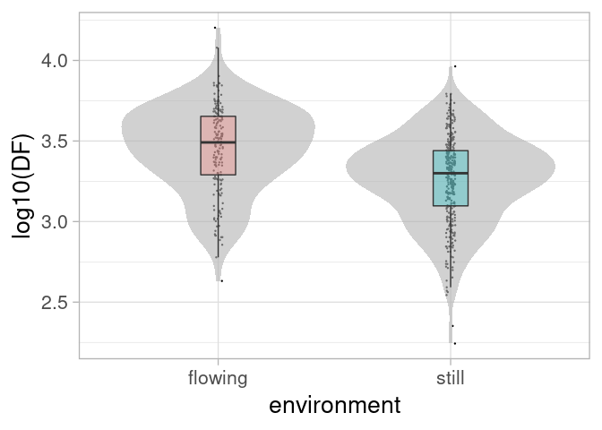

<!-- README.md is generated from README.Rmd. Please edit that file -->

# anura

<!-- badges: start -->

[](https://travis-ci.org/paternogbc/anura)
<!-- badges: end -->

A Global Dataset of Anuran Species Advertisement Call

## Installation

You can install the anura package from [GitHub](https://github.com/)
with:

``` r
# install.packages("devtools")
devtools::install_github("paternogbc/anura")
```

## Help

In `R`, documentation for anura dataset can be accessed with the
standard `help` command (e.g., `?anura.data` and `?anura.tree`).

For a online description of the dataset, see [reference
page](https://paternogbc.github.io/anura/reference/anura.data.html)

## Example

How to load and use anura.data?

``` r
library(anura)

# check anura data.frame
knitr::kable(head(anura.data))
```

| fam            | sp                         | environment |   DF |   SVL |
| :------------- | :------------------------- | :---------- | ---: | ----: |
| Allophrynidae  | Allophryne\_ruthveni       | still       | 4645 | 20.60 |
| Alsodidae      | Alsodes\_nodosus           | flowing     | 1140 | 75.85 |
| Alytidae       | Alytes\_cisternasii        | flowing     | 1491 | 41.00 |
| Arthroleptidae | Cardioglossa\_occidentalis | flowing     | 4100 | 27.30 |
| Arthroleptidae | Leptopelis\_argenteus      | still       | 1750 | 45.00 |
| Arthroleptidae | Leptopelis\_bocagii        | still       |  600 | 52.00 |

``` r

# fit a model
fit <- lm(log10(DF) ~ environment, anura.data)

# make a plot
library(ggplot2)
ggplot(anura.data, aes(y = log10(DF), 
                       x = environment)) +
  geom_jitter(width = .02, size = .2) +
  geom_violin(alpha = .6, fill = gray(.7), color = NA) +
  geom_boxplot(aes(fill = environment),
               alpha = .3, width = .15,
               outlier.color = NA,
               show.legend = F) +
  theme_light(base_size = 20)
```


